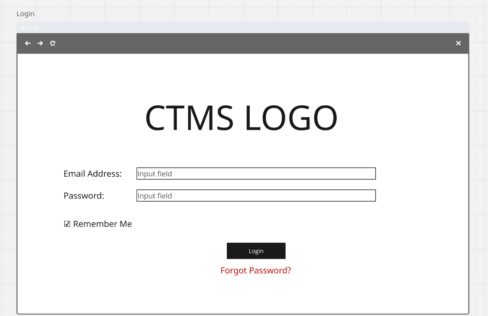
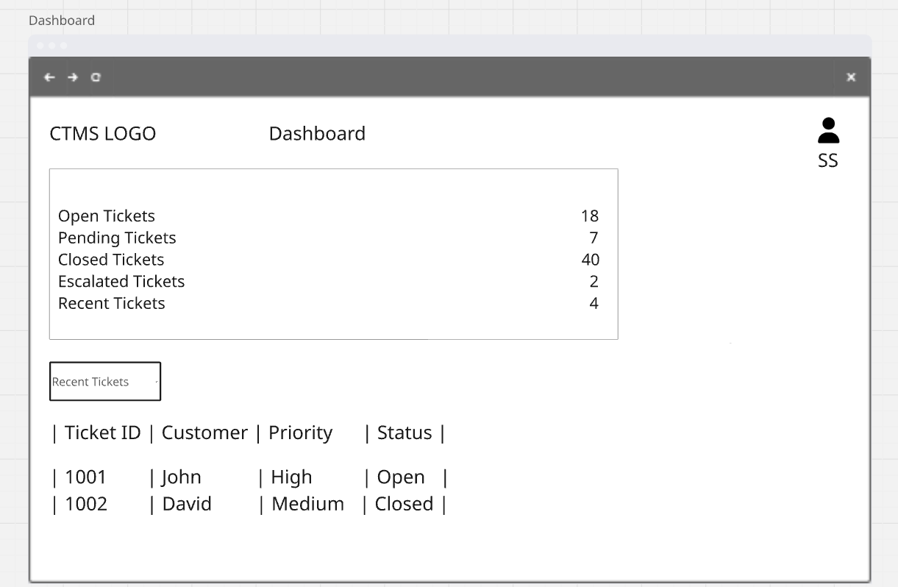
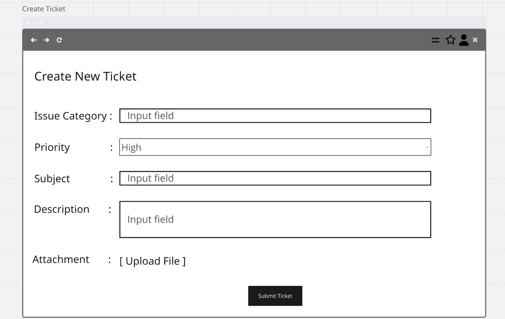
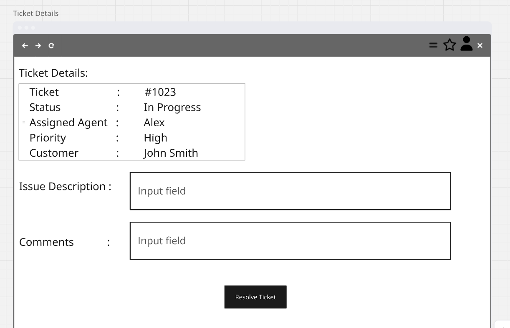
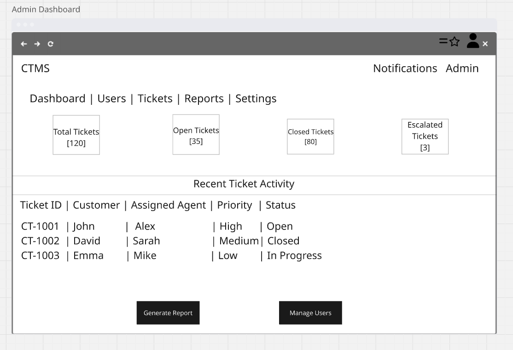

# 📌 Customer Ticket Management System (CTMS)

## Agile Requirements Documentation (ARD)

> **Project Type:** Business Analysis (Agile Scrum Case Study)  
> **Domain:** Customer Support & Service Management  
> **Methodology:** Agile Scrum  
> **Tools Used:** Microsoft Word, Miro, Draw.io, GitHub

---

## 📖 Project Overview

The Customer Ticket Management System (CTMS) is an Agile Business Analysis case study designed to improve customer support operations by providing a centralized platform for ticket creation, tracking, assignment, escalation, and resolution.

The project follows Agile Scrum practices and demonstrates how business requirements can be translated into product features, user stories, acceptance criteria, sprint-ready backlog items, and testable business requirements.

The case study was developed collaboratively, covering different aspects of Agile Business Analysis including requirement analysis, user story development, backlog management, sprint planning, wireframing, UAT, and requirement traceability.

---

## 🎯 Business Objectives

- Improve customer support efficiency
- Reduce ticket resolution time
- Increase customer satisfaction
- Automate ticket assignment and tracking
- Improve reporting and visibility
- Enable better monitoring of ticket lifecycle and support performance

---

## 📂 Repository Structure

```text
CTMS-Agile
│
├── Assets
│   └── Cover-Page.png
│
├── Documentation
│   └── CTMS_Agile_Requirements_Document.pdf
│
├── Wireframes
│   ├── Login.png
│   ├── Customer-Dashboard.png
│   ├── Create-Ticket.png
│   ├── Ticket-Details.png
│   └── Admin-Dashboard.png
│
└── README.md
```

---

## 🖥️ Wireframes

### Login



---

### Customer Dashboard



---

### Create Ticket



---

### Ticket Details



---

### Admin Dashboard



---

---

## 📑 Agile Deliverables

✔ Product Vision  
✔ Business Objectives  
✔ Stakeholder Analysis  
✔ User Personas  
✔ Product Roadmap  
✔ Epic & Feature Breakdown  
✔ Story Mapping  
✔ Product Backlog  
✔ User Stories  
✔ Acceptance Criteria  
✔ Business Rules  
✔ Definition of Ready (DoR)  
✔ Definition of Done (DoD)  
✔ Story Estimation  
✔ Sprint Planning  
✔ Sprint Backlog  
✔ Wireframes  
✔ User Acceptance Testing (UAT)  
✔ Requirement Traceability Matrix (RTM)  
✔ Risks & Assumptions  
✔ Future Enhancements  

---

## 👥 Project Contributors

### Shivani Pal

**Contribution:**
- Business Requirement Analysis
- Product Vision & Roadmap
- Stakeholder Analysis
- User Personas
- Epic & Feature Definition
- User Story Documentation
- Wireframe & Solution Design
- Agile Requirements Documentation

### Satyam Singh

**Contribution:**
- Requirement Analysis
- User Story Review & Refinement
- Acceptance Criteria
- Product Backlog Analysis
- Sprint Planning & Sprint Backlog
- UAT Scenario Preparation
- Requirement Traceability Matrix (RTM)
- Business Rules & Requirement Validation

---

## 🤝 Collaboration

This Agile case study was developed collaboratively, with contributions across requirement analysis, Agile documentation, user story development, backlog management, sprint planning, wireframing, UAT, and requirement traceability.

The project demonstrates the application of Agile Scrum practices throughout the Business Analysis lifecycle, from understanding business needs to validating requirements against expected business outcomes.

---

## 🛠️ Skills Demonstrated

### Business Analysis
- Business Requirement Analysis
- Requirement Gathering
- Stakeholder Analysis
- Business Rules
- Requirement Validation

### Agile & Scrum
- Agile Scrum
- Product Backlog Management
- User Story Writing
- Acceptance Criteria
- Sprint Planning
- Sprint Backlog
- Definition of Ready (DoR)
- Definition of Done (DoD)

### Testing & Documentation
- User Acceptance Testing (UAT)
- Requirement Traceability Matrix (RTM)
- Business Requirements Documentation
- Requirement Documentation
- Wireframing

---

## 👩‍💼 Project Authors

**Shivani Pal**  
Business Analyst

**Satyam Singh**  
Business Analyst

---

## 📫 Contact

### Shivani Pal
**LinkedIn:**  
https://www.linkedin.com/in/shivani-pal-25268020a/

**Email:**  
shivanipal8630@gmail.com

### Satyam Singh
**LinkedIn:**  
https://www.linkedin.com/in/satyam-singh-268b29258/

**Email:**  
satyams0807@gmail.com
