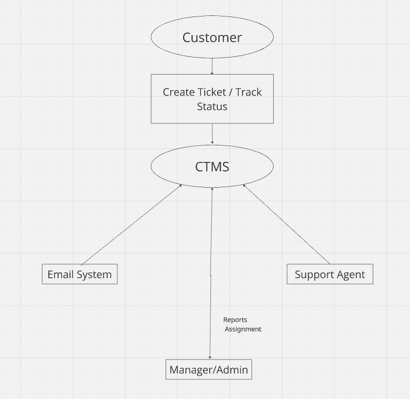
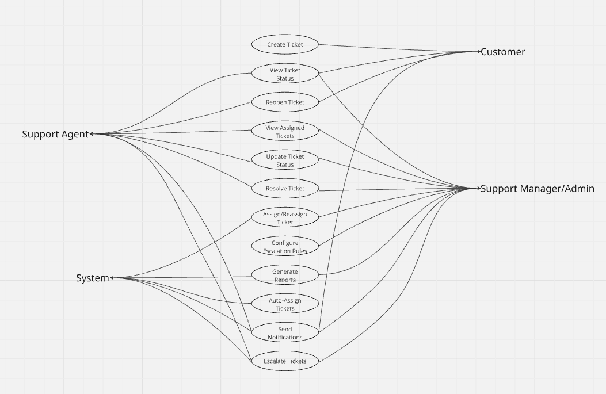

# 📌 Customer Ticket Management System (CTMS)

## Business Analysis Case Study

> **Project Type:** Business Analysis Case Study  
> **Domain:** Customer Support & Service Management  
> **Methodology:** Waterfall  
> **Tools Used:** Microsoft Word, Microsoft Excel, Miro, GitHub

The Customer Ticket Management System (CTMS) is a Business Analysis case study developed to streamline customer support operations by replacing manual issue tracking with a centralized ticket management solution. The project demonstrates the complete Business Analysis lifecycle, including business process analysis, requirement documentation, stakeholder identification, and solution design.

---

# 📖 Table of Contents

- Project Overview
- Business Problem
- Business Objectives
- Project Scope
- Stakeholders
- Business Analysis Deliverables
- Project Documentation
- Process Analysis
- System Diagrams
- Tools Used
- Business Value
- Skills Demonstrated

---

# 📌 Project Overview

The Customer Ticket Management System (CTMS) is a centralized platform designed to manage customer support requests efficiently from ticket creation to issue resolution. The system improves communication between customers and support teams while providing better visibility into ticket status, assignment, escalation, and overall support performance.

This project focuses on understanding business needs, identifying process gaps, documenting requirements, and proposing a structured solution that enhances operational efficiency and customer satisfaction.

---

# 🚩 Business Problem

The organization was experiencing several challenges in managing customer complaints due to a manual support process.

### Existing Challenges

- Customer issues were received through multiple communication channels.
- Manual tracking of tickets using spreadsheets resulted in data inconsistency.
- No centralized platform to monitor ticket status.
- Delays in ticket assignment and issue resolution.
- Limited visibility into support team performance.
- Difficulty generating reports and monitoring KPIs.

---

# 🎯 Business Objectives

The proposed Customer Ticket Management System aims to:

- Centralize customer ticket management.
- Automate ticket creation and assignment.
- Improve communication between customers and support teams.
- Reduce ticket response and resolution time.
- Enable escalation management.
- Provide reporting and performance monitoring through KPIs.

---

# 📌 Project Scope

## In Scope

The proposed Customer Ticket Management System includes the following features:

- Customer ticket creation
- Ticket assignment to support agents
- Ticket status tracking
- Ticket escalation management
- Customer notifications
- Reporting and performance dashboards

## Out of Scope

The following features are not included in the current project scope:

- Payment processing
- AI chatbot integration
- Live chat support
- Social media integration
- Third-party CRM integration

---

# 👥 Stakeholders

| Stakeholder | Responsibility |
|--------------|----------------|
| Customer | Raises support tickets and tracks issue status. |
| Support Agent | Handles and resolves assigned tickets. |
| Support Manager | Monitors support operations and team performance. |
| Admin | Manages users, roles, and system configuration. |
| Development Team | Designs and develops the proposed solution. |
| QA Team | Validates system functionality against business requirements. |

---

# 📑 Business Analysis Deliverables

This project includes the following Business Analysis artifacts:

- ✅ Executive Summary
- ✅ Business Objectives
- ✅ AS-IS Analysis
- ✅ TO-BE Analysis
- ✅ Scope Definition
- ✅ Stakeholder Analysis
- ✅ User Roles & Responsibilities
- ✅ Functional Requirements
- ✅ Non-Functional Requirements
- ✅ Use Case Diagram
- ✅ Context Diagram
- ✅ Assumptions, Risks & Dependencies
- ✅ Timeline & Milestones
- ✅ Success Metrics (KPIs)

---

# 📂 Project Documentation

| Document | Status |
|-----------|--------|
| Business Requirement Document (BRD) | ✅ Completed |
| Process Analysis | ✅ Completed |
| Functional Requirements | ✅ Completed |
| Non-Functional Requirements | ✅ Completed |
| Stakeholder Analysis | ✅ Completed |
| Use Case Diagram | ✅ Completed |
| Context Diagram | ✅ Completed |
| Timeline & Milestones | ✅ Completed |
| KPIs | ✅ Completed |

📄 **Business Requirement Document:** `BRD/CTMS_BRD.pdf`

---

# 🔄 Process Analysis

The Customer Ticket Management System (CTMS) was developed after analyzing the existing customer support process and identifying opportunities for improvement.

### Current Process (AS-IS)

The existing process relied on manual communication channels such as emails and phone calls to receive customer issues. Support teams tracked requests manually, resulting in delayed responses, limited visibility into ticket status, and difficulty monitoring overall performance.

### Proposed Process (TO-BE)

The proposed solution introduces a centralized ticket management system where customer issues are logged, assigned to support agents, tracked throughout their lifecycle, and escalated whenever required. This improves operational efficiency, transparency, and customer satisfaction.

### Key Improvements

- Centralized ticket management
- Automated ticket assignment
- Improved ticket tracking
- Faster issue resolution
- Better reporting and KPI monitoring
---

# 📊 System Diagrams

## Context Diagram

The Context Diagram illustrates the interaction between external stakeholders and the Customer Ticket Management System.



---

## Use Case Diagram

The Use Case Diagram represents the interactions between different users and the major functionalities of the Customer Ticket Management System.



---

# 🛠️ Tools Used

- Microsoft Word
- Microsoft Excel
- Miro
- GitHub

---

# 📈 Business Value

The proposed solution delivers the following business benefits:

- Improved customer satisfaction through faster issue resolution.
- Reduced manual effort by automating ticket assignment and tracking.
- Enhanced visibility into support operations.
- Better decision-making through reporting and KPIs.
- Increased operational efficiency and scalability.

---

# 💼 Skills Demonstrated

- Business Requirement Documentation (BRD)
- Requirement Gathering & Analysis
- Functional & Non-Functional Requirement Analysis
- Stakeholder Analysis
- Process Mapping (AS-IS & TO-BE)
- Business Process Improvement
- Context Diagram & Use Case Modelling
- Risk & Dependency Analysis
- KPI Definition
- Documentation & SDLC Understanding

---

# 📁 Repository Structure

```text
CTMS
│
├── README.md
├── BRD
│   └── CTMS_BRD.pdf
├── Process-Flows
│   ├── AS-IS-Process.png
│   └── TO-BE-Process.png
├── Diagrams
│   ├── Context-Diagram.png
│   └── Use-Case-Diagram.png
└── Assets
```

---

# 👩‍💼 Author

**Shivani**

Aspiring Business Analyst | Passionate about solving business problems through structured analysis, process improvement, and documentation.

📧 **Email:** shivanipal8630@gmail.com

💼 **LinkedIn:** https://www.linkedin.com/in/shivani-pal-25268020a/
